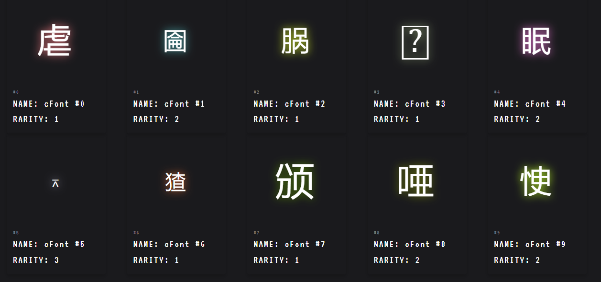

# NFT Staking

### Minting cFont
**minting 1 cFont always use 100 eBTC**

You need to allow eBTC for minting first then you can mint cFont.


### Reward calculation



NFT Staking reward depends on NFT rarity. Every 7 days any user can call "distributeReward()" function to distributed reward to self and other staker. 
The reward will be calculated by the fomula below

```
Reward of NFT(id) = ((eBTC.balanceOf(cFontContract) / Allrarity) !> 10 * 10**18 ) + feePerRarity

In English
- distribute no more than 10 eBTC token per 1 NFT rarity and adding feePool the the reward late.
```

### Recieve reward


User can recieve reward in 2 parts. First is eBTC reward and second is ETH reward(Native token change depend on chain).

After withdraw reward. Your wallet will topup automatically.
